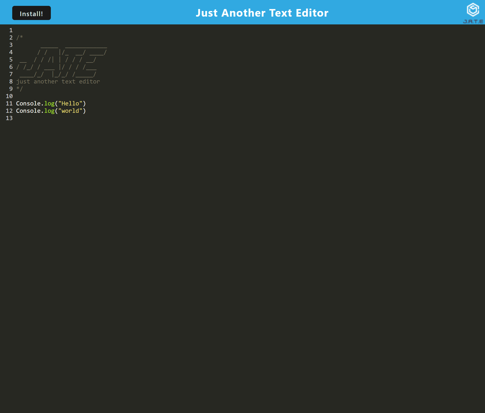
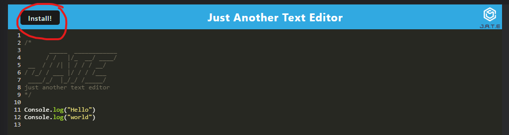

# Text-Editor

## Description

This project aims to build a text editor that runs in the browser as a Progressive Web Application (PWA). The text editor will meet the PWA criteria and will implement data persistence techniques to ensure redundancy even if one of the options is not supported by the browser. The application will also be functional offline.

## Usage

When you load onto the for the first time, you will see a welcome "JATE" message, you can add text into the text editor.

After typing into the editor, once u click off of the page, the document will be saved and loaded the next time the page is launched.

The site makes use of service workers and workbox to achieve off line functionality

Clicking the "Install" button in the text editor PWA triggers the installation of the web application as a Progressive Web App (PWA) on your device. You can also click on the download button located in the URL.

Live Deployed URL: https://immense-anchorage-50069-9be7673abfbc.herokuapp.com/  
GitHub URL: https://github.com/TimeBytes/Text-Editor

## Credits

Used PWA - Mini Project as reference for structure and coding patterns  
https://utoronto.bootcampcontent.com/utoronto-bootcamp/UTOR-VIRT-FSF-PT-02-2023-U-LOLC/-/tree/main/19-PWA/01-Activities/28-Stu_Mini-Project

## License

MIT LICENSE
